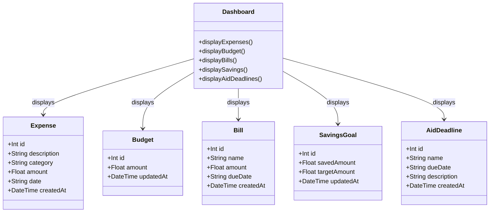

# SteadyStep Class Diagram

## Overview

This class diagram represents the primary data entities used by the SteadyStep student finance application. These entities support expense tracking, budgeting, bill reminders, savings goals, and financial aid deadline tracking.

## Design Notes

The SteadyStep dashboard acts as the main interface through which the student views financial information. The backend stores each major financial feature as a separate entity. This separation keeps the application organized and allows each feature to be maintained independently.

The class structure corresponds with the entities and functional requirements defined in the SteadyStep SRS.