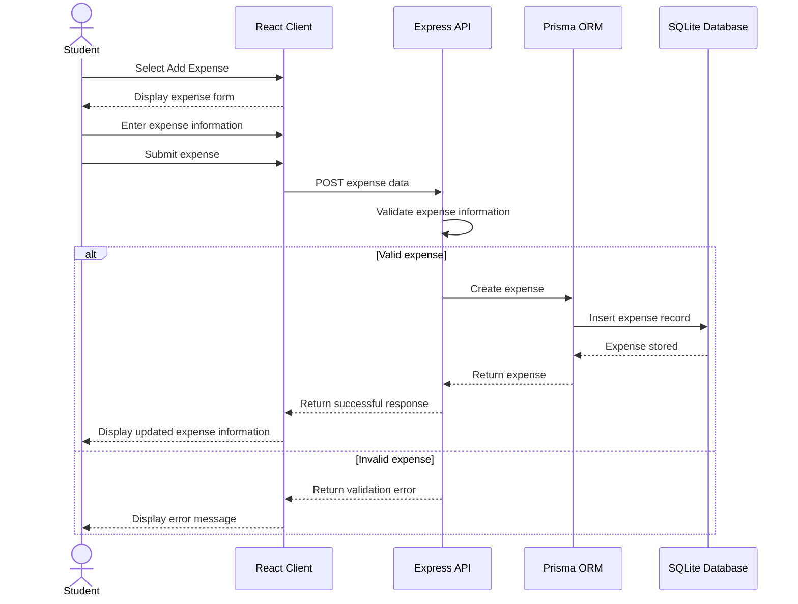

# SteadyStep Sequence Diagram

## Record an Expense

The following sequence diagram represents the primary flow for UC-01, Record an Expense.

## Sequence Description

The student begins the process by selecting the option to add an expense. The React client collects the expense information and sends it to the Express REST API. The server validates the submitted information before sending valid data through Prisma ORM to the SQLite database.

If the expense is valid, it is stored and returned to the client so the dashboard can reflect the updated financial information. If validation fails, the server returns an error and the expense is not stored.

This sequence corresponds with UC-01 and the FR-EXP requirements documented in the SteadyStep SRS.